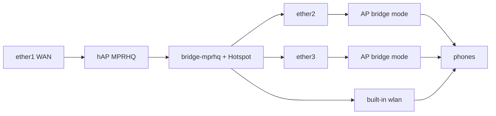
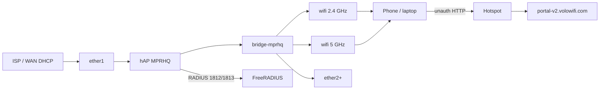

# MPRHQ — MikroTik hAP all-in-one Hotspot (Volo WiFi)

**Site / NAS-Identifier:** `MPRHQ`  
**Device:** MikroTik **hAP** with built-in WiFi (hAP, hAP ac², hAP ax², hAP ax³, or similar)  
**SSID:** `MPRHQ-Wifi` (open — login is Hotspot, not WPA)  
**Captive portal:** [https://portal-v2.volowifi.com](https://portal-v2.volowifi.com)

Use this pack when **one router does everything**: WAN, LAN ports, WiFi radios, DHCP/Hotspot, and RADIUS. There is **no external AP**.

For an **hEX S + external AP** (no radio), use [`MPRHQ-restore.rsc`](MPRHQ-restore.rsc) instead.

**Related:** [MikroTik setup guide](router-setup-mikrotik.md) · [Hotspot HTML](hotspot/README.md)

---

## Site parameters

| Parameter | Value |
|-----------|-------|
| Site / `/system identity` | `MPRHQ` (must match Volo **NAS-Identifier**) |
| Guest SSID | `MPRHQ-Wifi` |
| Hotspot gateway | `172.1.1.1/24` on `bridge-mprhq` |
| DNS / gateway given to clients | `172.1.1.1` |
| Client pool | `172.1.1.2` – `172.1.1.254` |
| WAN | `ether1` (DHCP client) |
| Guest LAN | remaining ether ports + all WiFi radios on `bridge-mprhq` |
| Captive portal | `portal-v2.volowifi.com` |
| Portal API | `portal-api.volowifi.com` |
| FreeRADIUS | `159.223.63.109` `:1812` / `:1813` |
| CoA / Disconnect | UDP `3799` inbound |
| RADIUS secret | same secret as in [`MPRHQ-hap-restore.rsc`](MPRHQ-hap-restore.rsc) |

Hotspot runs on the **bridge**, not on `wlan1` / `wifi1` alone. Wired clients on ether2+ and WiFi clients share the same captive portal.

---

## Extra APs on ether2 / ether3 / ether4 / ether5

No extra RouterOS import is required. Those ports are already members of `bridge-mprhq`, so a phone on an external AP hits the **same** Hotspot as the built-in `MPRHQ-Wifi`.



On **each** extra AP (MikroTik, TP-Link, Ruijie, etc.):

| Setting | Value |
|---------|--------|
| Mode | **AP / bridge / access point** — not router, not NAT |
| DHCP server | **Off** |
| WAN/LAN | All LAN ports + WiFi in one bridge (dumb AP) |
| Uplink cable | AP **LAN** port → hAP **ether2** (or ether3/4/5). Never ether1 |
| SSID | `MPRHQ-Wifi` (same name = roam). Must stay **open** (no WPA) |
| AP own IP | Static `172.1.1.2` / `.3` / `.4` (outside the phone pool) **or** skip DHCP on the AP |

**Ruijie / Reyee Quick Settings → WiFi** has no “same WiFi name” checkbox. Type **`MPRHQ-Wifi`** in the single SSID box — that name is used on both 2.4 GHz and 5 GHz. The wizard often **requires a password**; after **Finish**, open the full menu (**WLAN / SSID**) and set encryption to **Open / None** so Hotspot can show the portal. To check 2.4 vs 5 GHz names, use that full WLAN page, not the wizard.

Do **not** enable DHCP or another Hotspot on the AP. Do **not** plug the AP WAN port into the hAP if that AP is still in router mode (double NAT + second DHCP).

If the AP needs cloud management (internet before portal), bypass its MAC on the hAP:

```routeros
/ip hotspot ip-binding add mac-address=AA:BB:CC:DD:EE:FF type=bypassed comment="AP ether2"
```

Use the **AP’s Ethernet MAC**, not a phone MAC.

Plug extra APs into **ether2 / ether3** (not ether4 if you use the office-laptop script below).

Test: join the extra AP’s SSID → IP `172.1.1.x` → `http://neverssl.com` → same portal with `NASID=MPRHQ`.

---

## Trusted laptop on ether4 (internet, no portal)

Guest Hotspot is on `bridge-mprhq`. A laptop on ether4 would otherwise get the same captive portal as WiFi. To give **immediate internet** on ether4, take that port **off the guest bridge** and give it its own LAN.

Upload [`MPRHQ-ether4-office.rsc`](MPRHQ-ether4-office.rsc) and import:

```routeros
/import file-name=MPRHQ-ether4-office.rsc
```

| Port | Role |
|------|------|
| ether1 | WAN |
| ether2, ether3, ether5 | Guest APs / Hotspot `172.1.1.0/24` |
| ether4 | Office laptop `192.168.88.0/24` — no portal |
| wlan1 / wlan2 | Guest `MPRHQ-Wifi` |

Laptop should get `192.168.88.x`, gateway `192.168.88.1`. Do **not** re-import `MPRHQ-hap-restore.rsc` after this (it deletes DHCP that is not on the guest bridge).

For **one known laptop only**, leave ether4 on the bridge and bypass its MAC instead:

```routeros
/ip hotspot ip-binding add mac-address=AA:BB:CC:DD:EE:FF type=bypassed comment="office laptop"
```

---

## VLAN on extra APs (optional)

You do **not** need a VLAN for extra APs on this site. The hAP bridge is **untagged**. Leave the Ruijie/Reyee wizard at **Bridge Mode** and **VLAN `1`**.

| Goal | AP VLAN field | MikroTik |
|------|----------------|----------|
| Same guest Hotspot as now (recommended) | **`1`** | No VLAN filtering. ether2/3 stay plain bridge ports |
| Tagged guest SSID + AP management | Guest **`100`**, mgmt **`1`** | Enable bridge VLAN filtering (below) |

**DHCP IP: Not Obtained** on that Ruijie screen is normal if VLAN does not match the hAP. With VLAN `1` and no filtering on MikroTik, the AP should get `172.1.1.x` from Hotspot DHCP. If it still fails, set a **static** AP IP (`172.1.1.2`, gateway `172.1.1.1`) and continue; phones on the SSID still work.

### If you really want tagged VLAN 100 for guest WiFi

Use the **same ID on both sides**. Example: guest **100**, AP management untagged **1**.

**Ruijie / Reyee AP**

- External / uplink: Bridge, management VLAN **`1`**
- Guest SSID `MPRHQ-Wifi`: VLAN **`100`** (SSID VLAN, not only the wizard field)
- Open SSID, DHCP off

**hAP (after current restore is working)**

```routeros
# Trunk on AP ports: untagged = AP management (1), tagged = guest (100)
/interface bridge set bridge-mprhq vlan-filtering=yes
/interface bridge port set [find interface=ether2] pvid=1
/interface bridge port set [find interface=ether3] pvid=1
/interface bridge port set [find interface=ether4] pvid=1
/interface bridge port set [find interface=ether5] pvid=1
# Built-in WiFi stays on the guest VLAN
/interface bridge port set [find interface=wlan1] pvid=100
/interface bridge port set [find interface=wlan2] pvid=100

/interface bridge vlan
add bridge=bridge-mprhq tagged=bridge-mprhq,ether2,ether3,ether4,ether5 \
    untagged=wlan1,wlan2 vlan-ids=100
add bridge=bridge-mprhq tagged=bridge-mprhq untagged=ether2,ether3,ether4,ether5 \
    vlan-ids=1

/interface vlan add name=vlan-guest interface=bridge-mprhq vlan-id=100 \
    comment="MPRHQ guest Hotspot"

# Move guest IP + Hotspot off the plain bridge onto vlan-guest
/ip address set [find interface=bridge-mprhq] interface=vlan-guest
/ip dhcp-server set [find name=mprhq-dhcp] interface=vlan-guest
/ip hotspot set [find] interface=vlan-guest
```

Do **not** set the Ruijie wizard VLAN to `100` unless the hAP ether port also tags/accepts VLAN 100 — a mismatch is exactly **DHCP Not Obtained**.

Volo site / NAS-Identifier stays **`MPRHQ`**. VLAN is only L2 on the cable; RADIUS and the portal do not change.

---

## Topology



| Port / radio | Role |
|--------------|------|
| `ether1` | WAN only — **not** on the guest bridge |
| `ether2` … `ether5` | Guest LAN (added only if the port exists) |
| `sfp1` | Guest LAN if present (most hAP models skip this) |
| `wlan1` / `wlan2` **or** `wifi1` / `wifi2` | Guest SSID `MPRHQ-Wifi`, open, bridged |

---

## Volo WiFi admin (before import)

**Site Directory** → site `MPRHQ` → **Network**

| Field | Value |
|-------|-------|
| Portal base URL | `https://portal-v2.volowifi.com` |
| RADIUS vendor profile | MikroTik |
| NAS-Identifier | `MPRHQ` |
| RADIUS shared secret | same as the restore script |

**NAS Devices**

| Field | Value |
|-------|-------|
| Type | Router |
| Vendor | MikroTik |
| Linked site | `MPRHQ` |
| RADIUS client | On |
| NAS type | `mikrotik` |
| NAS short name | `MPRHQ` |

Register the router’s **public (WAN) IP** as the FreeRADIUS client source if the NAS is NATed; otherwise use the address FreeRADIUS actually sees.

---

## Clean reinstall (recommended)

Do this when WiFi connects but gets **no IP**, Hotspot is INVALID, or factory `dhcp1` on ether2 is mixed with this script. A no-defaults reset is cleaner than patching leftover factory config.

1. In Winbox Terminal:

   ```routeros
   /system reset-configuration no-defaults=yes skip-backup=yes
   ```

2. Wait for reboot. Connect Winbox by **MAC** (this hAP ac: `D0:EA:11:5A:80:6A`). There is no IP yet.

3. Upload **`docs/hotspot/`** → router **`flash/hotspot/`** (must include `login.html`).

4. Upload the latest [`MPRHQ-hap-restore.rsc`](MPRHQ-hap-restore.rsc).

5. Import:

   ```routeros
   /import file-name=MPRHQ-hap-restore.rsc
   ```

6. When Terminal shows **`turn off power or reboot by pressing reset or mode button`**: **unplug the power**. Do **not** use Winbox Reboot. Plug back in after 5 seconds.

7. Reconnect by MAC. Check:

   ```routeros
   /system device-mode print
   /interface bridge port print
   /ip dhcp-server print
   /ip hotspot print
   /ip address print where interface=bridge-mprhq
   ```

   Expected: `hotspot: yes` · `wlan1`/`wlan2` on `bridge-mprhq` · DHCP on **`bridge-mprhq`** (not ether2) · `mprhq-hotspot` **not** INVALID · address `172.1.1.1/24`.

8. Phone: forget WiFi, join **`MPRHQ-Wifi`** (no password). IP should be `172.1.1.x`. Then open `http://neverssl.com`.

This hAP ac uses **`wlan1` / `wlan2`**. The script also supports `wifi1` / `wifi2` on ax models. Dual-band devices get the same SSID on 2.4 GHz and 5 GHz.

---

## Hotspot INVALID (RouterOS 7)

Winbox green **INVALID** on `mprhq-hotspot` means the server cannot bind. Check in this order.

### 1. Device-mode (most common on ROS 7)

```routeros
/system device-mode print
```

If `hotspot` is `no`:

```routeros
/system device-mode update hotspot=yes
```

Leave that countdown on screen. Within ~5 minutes, **unplug power** or **short-press Mode / Reset** on the hAP. Do **not** use `/system reboot` — RouterOS ignores a software reboot for this confirm.

Do **not** hold Reset for 5+ seconds (that factory-resets the router).

### 2. Guest IP must be a host address, not `.0`

`172.1.1.0` is the **network** address of `172.1.1.0/24`. Hotspot-address must be a real host IP on the bridge (`172.1.1.1`). Winbox **IP of DNS Name = 0.0.0.0** is the usual symptom.

```routeros
/ip address print where interface=bridge-mprhq
/ip hotspot profile print detail where name=mprhq-profile
```

### 3. Quick live fix

```routeros
/import file-name=MPRHQ-invalid-fix.rsc
```

Then, if the Terminal shows a countdown, unplug power (do not `/system reboot`).

### 4. Other checks

```routeros
/interface bridge print
/file print where name~"hotspot/login"
```

`bridge-mprhq` must be running. HTML should be `flash/hotspot/login.html` (on some devices the folder is `hotspot/` without `flash/` — if files are missing, upload `docs/hotspot/` again). Missing HTML does **not** usually cause INVALID; it only breaks the portal page.

---

## What the script adds beyond hEX restore

| Item | Why |
|------|-----|
| Open SSID `MPRHQ-Wifi` | Built-in AP; no WPA (WPA blocks captive portal) |
| Radios on `bridge-mprhq` | WiFi clients get the same Hotspot as LAN |
| `nas-port-type=wireless-802.11` | This NAS is a WiFi AP, not an ethernet-only hEX |
| Skip missing ports (`sfp1`, extra ether) | Same file works on hAP lite / ac² / ax² |

Unchanged vs the hEX script: identity `MPRHQ`, guest net `172.1.1.0/24` with gateway `172.1.1.1`, RADIUS, walled garden, NAT, guest input firewall.

Guest DHCP is **`mprhq-dhcp` on `bridge-mprhq`**. Do **not** add another DHCP server on `ether2` or on `wlan1`.

---

## After import — verify

```routeros
/system identity print
/interface bridge port print
/interface wireless print
/interface wifi print
/ip hotspot print detail where name=mprhq-hotspot
/ip hotspot profile print detail where name=mprhq-profile
/radius print
/file print where name~"hotspot/login"
```

Phone test:

1. Forget old WiFi. Join **`MPRHQ-Wifi`** (no password).
2. Open `http://neverssl.com`.
3. Address bar should go to **`portal-v2.volowifi.com`** with `NASID=MPRHQ`.
4. After a valid token, `/ip hotspot active print` shows the client.

---

## Troubleshooting

| Symptom | Action |
|---------|--------|
| Hotspot **INVALID** | `device-mode hotspot=yes` + **physical power-off or Mode button** (not Winbox reboot); guest IP must be `172.1.1.1` not `.0`. Import [`MPRHQ-invalid-fix.rsc`](MPRHQ-invalid-fix.rsc) |
| No SSID | `/interface print`; confirm `wlan*` or `wifi*` is enabled and not `disabled=yes` |
| SSID exists, no portal | Upload `flash/hotspot/login.html`; allow DNS on input (already in script) |
| Portal “site not found” / NAS-Identifier empty | Identity is already `MPRHQ` in the rsc. Re-upload `login.html` that includes `NASID=$(identity)`. Do not use Reset HTML. Site Directory NAS-Identifier must be `MPRHQ`. |
| Login twice / bounce back | Profile must allow **http-pap** (script includes it) |
| WiFi connected, **no IP** | DHCP must be on `bridge-mprhq`, not `ether2`. Disable leftover `dhcp1`. Confirm `wlan1`/`wlan2` are bridge ports |
| Phone gets IP from somewhere else | Only this router DHCP/Hotspot; do not run DHCP on a CPE behind ether2 |
| `wlan1` vs `wifi1` mismatch | Script handles both; do not mix leftover default `bridge` from factory config — use **no-defaults** reset |
| WAN has no internet | `/ip dhcp-client print`; ether1 must **not** be a bridge port |

Debug while testing:

```routeros
/system logging add topics=hotspot,debug action=memory
/log print where topics~"hotspot"
/radius monitor 0 once
```

---

## Files

| File | Use |
|------|-----|
| [`MPRHQ-hap-restore.rsc`](MPRHQ-hap-restore.rsc) | **This site** — hAP all-in-one import |
| [`MPRHQ-invalid-fix.rsc`](MPRHQ-invalid-fix.rsc) | Live fix if Hotspot shows **INVALID** |
| [`MPRHQ-ether4-office.rsc`](MPRHQ-ether4-office.rsc) | ether4 trusted laptop LAN (no portal) |
| [`MPRHQ-restore.rsc`](MPRHQ-restore.rsc) | hEX S + **external** AP on ether2 |
| [`hotspot/`](hotspot/) | Captive redirect pages → `flash/hotspot/` |
