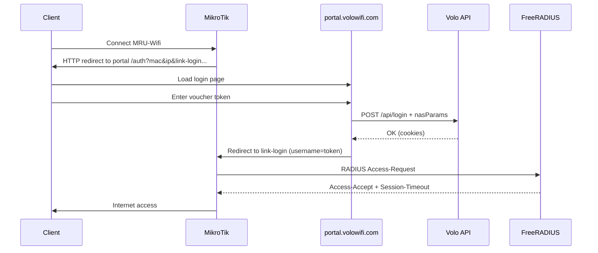

# MRU001 — MikroTik Hotspot Setup (Volo WiFi)

**Site code:** `MRU001`  
**NAS short name:** `MRUI001`  
**SSID:** `MRU-Wifi`  
**Captive portal:** [https://portal.volowifi.com/auth](https://portal.volowifi.com/auth)

**Related:** [MikroTik setup guide](router-setup-mikrotik.md) · [Admin onboarding](admin-menu.md)

---

## Site parameters

| Parameter | Value |
|-----------|-------|
| Site code | `MRU001` |
| NAS short name | `MRUI001` |
| WiFi SSID | `MRU-Wifi` |
| Captive portal URL | `https://portal.volowifi.com/auth` |
| FreeRADIUS server | `68.183.181.73` |
| RADIUS auth port | `1812` |
| RADIUS acct port | `1813` |
| RADIUS shared secret | `qtLbLRCHG2Jj1vAOqgb1G0mhYE0z19zY` |
| Hotspot gateway IP (NAS IP) | `10.10.10.1` *(adjust to your router)* |
| Client pool | `10.10.10.2` – `10.10.10.254` |

> **Important:** `10.10.10.1` must be the IP FreeRADIUS sees as the RADIUS client source. Register the same IP in Volo WiFi (**Site → RADIUS client IP**) and in FreeRADIUS `clients.conf`.

---

## Volo WiFi admin (before router script)

Configure in the admin console so RADIUS policy matches this NAS.

### Site Directory — `MRU001`

**Route:** `/wifi/sites` → edit site `MRU001` → **Network** tab

| Field | Value |
|-------|-------|
| Portal base URL | `https://portal.volowifi.com/auth` |
| RADIUS vendor profile | MikroTik profile |
| RADIUS client IP | `10.10.10.1` *(your hotspot gateway)* |
| RADIUS shared secret | `qtLbLRCHG2Jj1vAOqgb1G0mhYE0z19zY` |

### NAS Devices — `MRUI001`

**Route:** `/wifi/network/nas-devices`

| Field | Value |
|-------|-------|
| Type | Router |
| Vendor | MikroTik |
| Linked site | `MRU001` |
| IP address | `10.10.10.1` |
| RADIUS client (NAS) | **On** |
| NAS short name | `MRUI001` |
| RADIUS shared secret | `qtLbLRCHG2Jj1vAOqgb1G0mhYE0z19zY` |
| NAS type | `mikrotik` |

---

## FreeRADIUS server (`68.183.181.73`)

Add to `clients.conf` (or included file) on the FreeRADIUS host:

```conf
client MRUI001 {
    ipaddr          = 10.10.10.1
    secret          = qtLbLRCHG2Jj1vAOqgb1G0mhYE0z19zY
    shortname       = MRUI001
    nas_type        = other
    require_message_authenticator = no
}
```

Reload FreeRADIUS:

```bash
freeradius -XC    # config test
systemctl restart freeradius
```

Test from the server:

```bash
radtest TESTTOKEN "" 10.10.10.1 0 qtLbLRCHG2Jj1vAOqgb1G0mhYE0z19zY
```

Replace `TESTTOKEN` with a real issued access token.

---

## MikroTik RouterOS script

Standalone script file: **[MRU001.rsc](MRU001.rsc)** (same folder as this doc).

Copy into **Terminal**, or upload to the router and import:

```routeros
/import file-name=MRU001.rsc
```

**Before running:** edit `MRU001.rsc` — set `WLAN_IF` (e.g. `wlan1` / `wifi1`) and `WAN_IF` (e.g. `ether1`).

```routeros
# =============================================================================
# MRU001 — Volo WiFi / MikroTik Hotspot
# Site: MRU001 | NAS: MRUI001 | SSID: MRU-Wifi
# Portal: https://portal.volowifi.com/auth
# RADIUS: 68.183.181.73:1812/1813
# =============================================================================

:local HS_BRIDGE "bridge-mru001"
:local HS_POOL   "mrui001-pool"
:local HS_PROFILE "mrui001-profile"
:local HS_SERVER  "mrui001-hotspot"
:local WLAN_IF    "wlan1"
:local HS_GW      "10.10.10.1"
:local HS_NET     "10.10.10.0/24"
:local PORTAL_URL "https://portal.volowifi.com/auth"
:local RADIUS_IP  "68.183.181.73"
:local RADIUS_SECRET "qtLbLRCHG2Jj1vAOqgb1G0mhYE0z19zY"

# --- 1. Bridge for guest WiFi ---
:if ([:len [/interface bridge find name=$HS_BRIDGE]] = 0) do={
    /interface bridge add name=$HS_BRIDGE comment="MRU001 Volo hotspot"
}

# --- 2. Wireless — SSID MRU-Wifi (open; auth via Hotspot) ---
:if ([:len [/interface wireless find name=$WLAN_IF]] > 0) do={
    /interface wireless set $WLAN_IF mode=ap-bridge ssid="MRU-Wifi" \
        security-profile=none disabled=no bridge=$HS_BRIDGE
}

# RouterOS v7 WiFi package (uncomment if using wifi1 instead of wlan1):
# /interface wifi set wifi1 disabled=no configuration.ssid="MRU-Wifi"
# /interface bridge port add bridge=$HS_BRIDGE interface=wifi1

# --- 3. Hotspot gateway IP ---
:if ([:len [/ip address find address=($HS_GW . "/24")]] = 0) do={
    /ip address add address=($HS_GW . "/24") interface=$HS_BRIDGE comment="MRU001 hotspot GW"
}

# --- 4. DHCP pool ---
:if ([:len [/ip pool find name=$HS_POOL]] = 0) do={
    /ip pool add name=$HS_POOL ranges=10.10.10.2-10.10.10.254
}

# --- 5. Hotspot profile — external Volo portal + RADIUS ---
:if ([:len [/ip hotspot profile find name=$HS_PROFILE]] = 0) do={
    /ip hotspot profile add name=$HS_PROFILE
}
/ip hotspot profile set $HS_PROFILE \
    hotspot-address=$HS_GW \
    dns-name=wifi.mru001.local \
    html-directory=hotspot \
    login-by=http-chap,http-pap,cookie \
    http-cookie-lifetime=1d \
    use-radius=yes \
    radius-accounting=yes \
    radius-interim-update=5m \
    nas-port-type=wireless-802.11 \
    login-url=$PORTAL_URL

# --- 6. Hotspot server ---
:if ([:len [/ip hotspot find name=$HS_SERVER]] = 0) do={
    /ip hotspot add name=$HS_SERVER interface=$HS_BRIDGE address-pool=$HS_POOL profile=$HS_PROFILE
} else={
    /ip hotspot set $HS_SERVER interface=$HS_BRIDGE address-pool=$HS_POOL profile=$HS_PROFILE disabled=no
}

# --- 7. RADIUS client (Volo FreeRADIUS) ---
:local radiusId [/radius find comment="MRUI001"]
:if ([:len $radiusId] = 0) do={
    /radius add service=hotspot address=$RADIUS_IP secret=$RADIUS_SECRET \
        authentication-port=1812 accounting-port=1813 timeout=3s comment="MRUI001"
} else={
    /radius set $radiusId address=$RADIUS_IP secret=$RADIUS_SECRET \
        authentication-port=1812 accounting-port=1813 service=hotspot timeout=3s
}

# --- 8. CoA / Disconnect (Volo vendor profile default port 3799) ---
/radius incoming set accept=yes port=3799

# --- 9. Walled garden — allow portal + API before login ---
/ip hotspot walled-garden ip remove [find comment~"MRU001"]
/ip hotspot walled-garden ip add action=accept dst-host=portal.volowifi.com comment="MRU001 portal"
/ip hotspot walled-garden ip add action=accept dst-host=volowifi.com comment="MRU001 volowifi root"
/ip hotspot walled-garden ip add action=accept dst-host=sms-api.volowifi.com comment="MRU001 API"
/ip hotspot walled-garden ip add action=accept protocol=udp dst-port=53 comment="MRU001 DNS UDP"
/ip hotspot walled-garden ip add action=accept protocol=tcp dst-port=53 comment="MRU001 DNS TCP"

# --- 10. NAT masquerade for guest internet (adjust WAN if not ether1) ---
:local WAN_IF "ether1"
/ip firewall nat remove [find comment="MRU001 masquerade"]
/ip firewall nat add chain=srcnat out-interface=$WAN_IF src-address=10.10.10.0/24 \
    action=masquerade comment="MRU001 masquerade"

# --- 11. Optional: block guest → router management ---
/ip firewall filter remove [find comment="MRU001 block guest to router"]
/ip firewall filter add chain=input in-interface=$HS_BRIDGE src-address=10.10.10.0/24 \
    action=drop comment="MRU001 block guest to router"

:put "MRU001 hotspot script finished. Verify: /ip hotspot print; /radius print"
```

### Post-import checks (RouterOS)

```routeros
/ip hotspot print detail
/ip hotspot profile print detail
/radius print detail
/ip hotspot walled-garden ip print
/interface wireless print
```

---

## Captive portal redirect — what is required

### Flow



### MikroTik query parameters sent to portal

When `login-url` is set, RouterOS redirects unauthenticated clients to:

```
https://portal.volowifi.com/auth?mac=AA:BB:CC:DD:EE:FF&ip=10.10.10.5&username=&link-login=http://10.10.10.1/login?...&link-orig=http://...&error=
```

| Parameter | Required | Purpose |
|-----------|----------|---------|
| `mac` | Yes | Client MAC — store in `nasParams` |
| `ip` | Yes | Client Hotspot IP |
| `link-login` | Yes | URL to send user back after portal login |
| `link-orig` | Yes | Original requested URL |
| `link-login-only` | Recommended | Login URL without redirect wrapper |
| `chap-id` | If CHAP | Hotspot CHAP handshake |
| `chap-challenge` | If CHAP | Hotspot CHAP handshake |
| `error` | Optional | Previous login error message |

### Portal must do after token login

1. **POST** `https://<API_HOST>/api/login`

```json
{
  "type": "VOUCHER_TOKEN",
  "token": "ABCD1234",
  "nasParams": {
    "mac": "AA:BB:CC:DD:EE:FF",
    "ip": "10.10.10.5",
    "link-login": "http://10.10.10.1/login?dst=...",
    "link-orig": "http://connectivitycheck.gstatic.com/generate_204",
    "link-login-only": "http://10.10.10.1/login"
  }
}
```

2. On success, **redirect the browser** to `link-login` (or `link-login-only`) with:

| Query param | Value |
|-------------|-------|
| `username` | Voucher token (same value sent to RADIUS User-Name) |
| `password` | Empty string, or same token — must match your Hotspot `login-by` + RADIUS setup |

Example redirect after login:

```
http://10.10.10.1/login?username=ABCD1234&password=&dst=http://connectivitycheck.gstatic.com/generate_204
```

3. MikroTik sends RADIUS request to `68.183.181.73`; FreeRADIUS validates token against Volo DB.

### API health check

```bash
curl -s https://<API_HOST>/api/check/server
```

Expected: `{ "status": "ok", ... }`

---

## Files to create or update

### A. MikroTik router (RouterOS)

| Item | Action |
|------|--------|
| [MRU001.rsc](MRU001.rsc) | Upload to router → `/import file-name=MRU001.rsc` |
| `/ip hotspot profile` → `login-url` | Must be `https://portal.volowifi.com/auth` |
| `/ip hotspot walled-garden` | Portal + API hosts (see script §9) |
| `hotspot/login.html` | **Usually not needed** when `login-url` is set — RouterOS auto-redirects |
| `hotspot/alogin.html` | Optional — custom “login success” page if not using external redirect |
| `hotspot/errors.html` | Optional — branded error pages |

Upload custom HTML only if redirect to external portal fails:

```html
<!-- hotspot/login.html minimal override -->
<html>
<head>
<meta http-equiv="refresh" content="0; url=https://portal.volowifi.com/auth?mac=$(mac)&ip=$(ip)&username=$(username)&link-login=$(link-login)&link-orig=$(link-orig)&error=$(error)">
</head>
<body>Redirecting to Volo WiFi...</body>
</html>
```

Upload via Winbox: **Files** → `hotspot` folder → replace `login.html`.

### B. Captive portal (`portal.volowifi.com`)

These live on the portal deployment (not in this admin repo). Update the auth app that serves `/auth`:

| Area | What to change |
|------|----------------|
| **Auth page** (`/auth`) | Parse MikroTik query string (`mac`, `ip`, `link-login`, `link-orig`, …) on page load |
| **Login handler** | Include parsed params as `nasParams` in `POST /api/login` |
| **Post-login redirect** | `window.location = linkLogin + '&username=' + token + '&password='` |
| **API base URL** | Env var pointing to Volo backend (e.g. `sms-api.volowifi.com` or your API host) |
| **CORS / cookies** | API must accept requests from `portal.volowifi.com`; cookies `secure` in production |

Suggested portal env:

```env
NEXT_PUBLIC_API_URL=https://sms-api.volowifi.com
NEXT_PUBLIC_PORTAL_URL=https://portal.volowifi.com
```

### C. Volo WiFi backend / FreeRADIUS (ops)

| Location | Action |
|----------|--------|
| FreeRADIUS `clients.conf` | Add `MRUI001` client block (see above) |
| Volo admin → Site `MRU001` | Portal URL + RADIUS IP + secret |
| Volo admin → NAS `MRUI001` | Device record with `nasType=mikrotik` |
| Plan RADIUS policies | `Session-Timeout` = `{timeSeconds}`, `Acct-Interim-Interval` = `300` |

### D. Walled garden — confirm API hostname

If login works but token validation fails in the browser, open DevTools → Network on the portal and note the API host. Add that host to walled garden:

```routeros
/ip hotspot walled-garden ip add action=accept dst-host=<your-api-host> comment="MRU001 API"
```

---

## Firewall checklist (MikroTik → internet)

| Rule | Port | Direction |
|------|------|-----------|
| RADIUS auth | UDP 1812 | MikroTik → `68.183.181.73` |
| RADIUS acct | UDP 1813 | MikroTik → `68.183.181.73` |
| CoA (optional) | UDP 3799 | `68.183.181.73` → MikroTik |
| HTTPS portal | TCP 443 | Clients → `portal.volowifi.com` |
| HTTPS API | TCP 443 | Clients → API host |
| DNS | UDP/TCP 53 | Clients → DNS resolver |

---

## Verification checklist

| # | Test | Expected |
|---|------|----------|
| 1 | Connect phone to `MRU-Wifi` | Redirect to `portal.volowifi.com/auth` |
| 2 | `curl -I https://portal.volowifi.com/auth` | HTTP 200 |
| 3 | Enter valid access token | Login success → internet works |
| 4 | `/ip hotspot active print` on MikroTik | User session listed |
| 5 | `radtest <token> "" 10.10.10.1 0 <secret>` on FR server | Access-Accept |
| 6 | Volo admin → site `MRU001` inventory | Portal URL + secret configured |
| 7 | Session / usage in analytics | RADIUS accounting received |

### Debug logging (temporary)

```routeros
/system logging add topics=hotspot,debug action=memory
/log print where topics~"hotspot"
```

---

## Troubleshooting

| Symptom | Fix |
|---------|-----|
| Portal does not open | Add `portal.volowifi.com` to walled garden; check DNS on client |
| Portal opens, API fails | Add API host to walled garden; check CORS on backend |
| Token OK, no internet | Verify RADIUS secret on MikroTik, Volo site, and FreeRADIUS |
| Redirect loop | Portal must redirect to `link-login` after `/api/login` success |
| `radius timeout` | UDP 1812/1813 blocked; ping `68.183.181.73` from MikroTik |
| Wrong NAS IP in FR logs | Set hotspot GW IP = `radiusClientIp` in Volo site `MRU001` |

---

## Quick reference

| Item | Value |
|------|-------|
| SSID | `MRU-Wifi` |
| Portal | [https://portal.volowifi.com/auth](https://portal.volowifi.com/auth) |
| RADIUS | `68.183.181.73:1812/1813` |
| Secret | `qtLbLRCHG2Jj1vAOqgb1G0mhYE0z19zY` |
| NAS name | `MRUI001` |
| Site | `MRU001` |

---

*Deployment doc for MRU001. Rotate RADIUS secret if this file is shared outside your ops team.*
