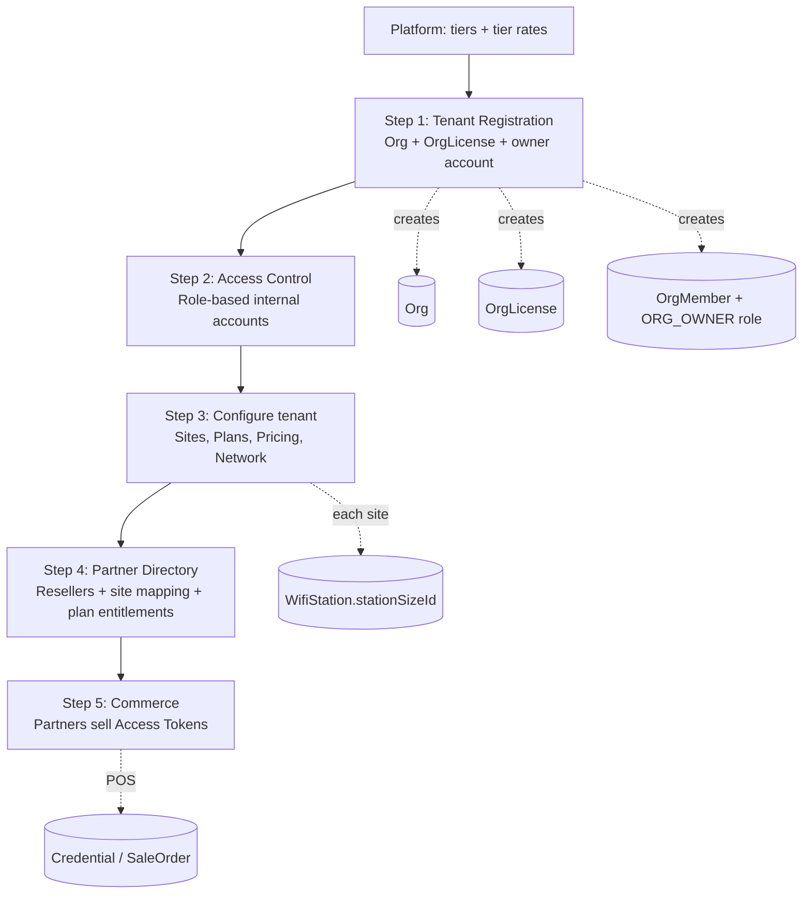

## HR System (MVP) — Admin Menu (Proposed)

Source: derived from implemented Prisma models in `HR Prisma/version 1/prisma/models/`.

### Menu groups and menus

| Group | Menu (Screen) | Purpose (MVP) | Main tables (Prisma models) |
|---|---|---|---|
| System | Admin Users | Admin management + token control | `Admin`, `AdminToken`, `EmailAccount` |
| System | Admin Roles & Permissions | Admin RBAC | `AdminRole`, `AdminRoleSetting`, `AdminMapRoleSetting` |
| System | Employee Portal Access | Employee portal RBAC | `EmployeeRole`, `EmployeePermission`, `EmployeeRolePermission` |
| System | Settings | System/company configuration | `Setting` |
| System | Audit Logs | Security/action logs | `AuditLog` |
| System | Files | File browser (optional) | `FileLog` |
| System | Contact & Support | Help/contact info for users | `Setting` (recommended for MVP) |
| System | Conversations | Only if used by the app | `Conversation` |

---

## Volo WiFi — Admin Navigation Specification

**Document:** admin navigation map for the WiFi module  
**Schema source:** `backend/src/prisma/models/wifi/`  
**Phase:** `MVP` | `P2` (delivery priority)

### Naming conventions

**Routes**

- Module root: `/wifi`
- Pattern: `/wifi/{domain}/{resource}` (kebab-case, plural for collections)
- Domains: `tenant`, `catalog`, `sites`, `access`, `billing`, `network`, `commerce`, `analytics`
- Avoid legacy flat paths (`/org`, `/resellers`, `/plans`, hyphenated top-level slugs)

**i18n keys**

- Groups: `menu-group.wifi.{domain}`
- Menus: `menus.wifi.{domain}.{resource}` (mirror route semantics; use dots, not slashes)
- English copy lives in translation files; keys stay stable when labels change

**Menu registry columns**

- **Label (EN)** — reference copy for designers / default locale
- **Menu key** — i18n lookup
- **Route** — app router path

### Navigation groups

| Sort | Group key | Label (EN) | Menu key (i18n) | Icon (suggested) | Audience |
|-----:|-----------|------------|-----------------|------------------|----------|
| 1 | `overview` | Overview | `menu-group.wifi.overview` | home | All roles |
| 2 | `tenant` | Tenant | `menu-group.wifi.tenant` | buildings | Platform admin, org admin |
| 3 | `billing` | Billing | `menu-group.wifi.billing` | wallet | Platform admin, org finance |
| 4 | `network` | Network | `menu-group.wifi.network` | wifi | Org admin, site operator |
| 5 | `commerce` | Commerce | `menu-group.wifi.commerce` | briefcase | Org admin, reseller |
| 6 | `analytics` | Analytics | `menu-group.wifi.analytics` | chart | Org admin, finance, site ops |

### WiFi menus (single registry)

| Sort | Group | Label (EN) | Menu key (i18n) | Route | Phase | Primary models | Description |
|-----:|-------|------------|-----------------|-------|-------|----------------|-------------|
| 1 | overview | Dashboard | `menus.wifi.overview.dashboard` | `/wifi` | MVP | `DailySalesStat`, `DailyRadiusUsageStat`, `RadiusSession` | Operational KPI dashboard |
| 1 | tenant | Tenant Directory | `menus.wifi.tenant.directory` | `/wifi/tenants` | MVP | `Org`, `OrgLicense` | Platform-wide tenant list |
| 2 | tenant | Tenant Profile | `menus.wifi.tenant.profile` | `/wifi/tenant/profile` | MVP | `Org` | Active tenant settings |
| 3 | tenant | Access Control | `menus.wifi.tenant.access-control` | `/wifi/tenant/access-control` | MVP | `Admin`, `OrgMember`, `OrgMemberRole`, `OrgMemberStation` | **Step 2:** after tenant exists — internal account create/link and role assignment |
| 4 | tenant | Activity Log | `menus.wifi.tenant.activity-log` | `/wifi/tenant/activity-log` | P2 | `WifiAuditLog` | Tenant-scoped audit trail |
| 5 | tenant | Service Plans | `menus.wifi.catalog.service-plans` | `/wifi/catalog/service-plans` | MVP | `Plan` | **Step 3:** internet plan catalog (retail products for tokens) |
| 6 | tenant | Retail Pricing | `menus.wifi.catalog.retail-pricing` | `/wifi/catalog/retail-pricing` | MVP | `PlanPriceBook`, `PlanPrice` | **Step 3:** reseller / site retail price books |
| 7 | tenant | Site Directory | `menus.wifi.sites.directory` | `/wifi/sites` | MVP | `WifiStation`, `StationSize` | **Step 3:** sites with required capacity tier (drives monthly license) |
| 8 | tenant | Voucher Runs | `menus.wifi.access.voucher-runs` | `/wifi/access/voucher-runs` | MVP | `VoucherBatch` | Bulk voucher generation (org admin; not reseller POS) |
| 1 | billing | Tenant Registration | `menus.wifi.billing.tenant-registration` | `/wifi/billing/tenant-registration` | MVP | `Org`, `OrgLicense`, `OrgMember`, `OrgMemberRole` | **Step 1 — onboarding entry:** create tenant + subscription (license) in one flow; no external invite |
| 2 | billing | Capacity Tiers | `menus.wifi.billing.capacity-tiers` | `/wifi/billing/capacity-tiers` | MVP | `StationSize` | Platform: site size tier catalog (setup before any tenant) |
| 3 | billing | Platform Tier Rates | `menus.wifi.billing.tier-rates.platform` | `/wifi/billing/tier-rates/platform` | MVP | `StationLicensePrice` | Platform: default monthly rate per tier |
| 4 | billing | Tenant Tier Rates | `menus.wifi.billing.tier-rates.tenant` | `/wifi/billing/tier-rates/tenant` | MVP | `OrgLicenseStationSizePrice` | Optional tenant-specific tier rate overrides |
| 5 | billing | Subscription | `menus.wifi.billing.subscription` | `/wifi/billing/subscription` | MVP | `OrgLicense` | Active subscription, site limit, billing cycle |
| 6 | billing | Licensed Sites | `menus.wifi.billing.subscription.sites` | `/wifi/billing/subscription/sites` | MVP | `OrgLicense`, `WifiStation`, `StationSize` | Billable sites grouped by tier |
| 7 | billing | Subscription Changelog | `menus.wifi.billing.subscription.changelog` | `/wifi/billing/subscription/changelog` | P2 | `OrgLicenseHistory`, `StationSize` | Limit, tier-rate, and status history |
| 8 | billing | Invoices | `menus.wifi.billing.invoices` | `/wifi/billing/invoices` | MVP | `OrgInvoice`, `OrgInvoiceItem`, `OrgInvoicePayment` | Monthly SaaS invoices (one line per site tier) |
| 1 | network | NAS Devices | `menus.wifi.network.nas-devices` | `/wifi/network/nas-devices` | MVP | `StationDevice` | Routers / AP / NAS inventory |
| 2 | network | Vendor Profiles | `menus.wifi.network.radius.vendor-profiles` | `/wifi/network/radius/vendor-profiles` | MVP | `RadiusVendorProfile`, `RadiusVendorProfileSupportedAttribute` | RADIUS vendor capability sets |
| 3 | network | Attribute Catalog | `menus.wifi.network.radius.attribute-catalog` | `/wifi/network/radius/attribute-catalog` | MVP | `RouterSupportedAttribute` | FreeRADIUS attribute dictionary |
| 4 | network | Plan RADIUS Policies | `menus.wifi.network.radius.plan-policies` | `/wifi/network/radius/plan-policies` | MVP | `PlanRadiusAttribute` | Per-plan RADIUS reply rules |
| 5 | network | Live Sessions | `menus.wifi.network.radius.live-sessions` | `/wifi/network/radius/live-sessions` | P2 | `RadiusSession` | Active and recent sessions |
| 6 | network | Auth Events | `menus.wifi.network.radius.auth-events` | `/wifi/network/radius/auth-events` | P2 | `Radpostauth` | Post-authentication event log |
| 1 | commerce | Partner Directory | `menus.wifi.commerce.partners.directory` | `/wifi/commerce/partners` | MVP | `Reseller`, `ResellerStation`, `ResellerPlanEntitlement` | **Step 4:** partner setup — site mapping and sellable plans |
| 2 | commerce | Partner Workspace | `menus.wifi.commerce.partners.workspace` | `/wifi/commerce/partners/workspace` | MVP | `Reseller`, `ResellerStation` | Logged-in partner home |
| 3 | commerce | Access Tokens | `menus.wifi.commerce.access-tokens` | `/wifi/commerce/access-tokens` | MVP | `Credential`, `CaptivePortalSession` | **Step 5:** partners sell/issue tokens (requires plans + pricing + entitlements) |
| 4 | commerce | Orders | `menus.wifi.commerce.transactions.orders` | `/wifi/commerce/transactions/orders` | MVP | `SaleOrder`, `SaleItem` | Sales order ledger |
| 5 | commerce | Payments | `menus.wifi.commerce.transactions.payments` | `/wifi/commerce/transactions/payments` | MVP | `Payment` | Tender and payment records |
| 6 | commerce | Commission Rules | `menus.wifi.commerce.commissions.rules` | `/wifi/commerce/commissions/rules` | P2 | `CommissionRule` | Reseller commission configuration |
| 7 | commerce | Commission Payouts | `menus.wifi.commerce.commissions.payouts` | `/wifi/commerce/commissions/payouts` | P2 | `CommissionPayout` | Payout workflow |
| 8 | commerce | Partner Insights | `menus.wifi.commerce.partners.insights` | `/wifi/commerce/partners/insights` | MVP | `DailySalesStat`, `DailyRadiusUsageStat` | Reseller-scoped analytics |
| 1 | analytics | Tenant Analytics | `menus.wifi.analytics.tenants` | `/wifi/analytics/tenants` | P2 | `Org`, `DailySalesStat` | Cross-tenant summary |
| 2 | analytics | Site Analytics | `menus.wifi.analytics.sites` | `/wifi/analytics/sites` | MVP | `WifiStation`, `StationSize`, `DailySalesStat`, `DailyRadiusUsageStat` | Usage and sales by site / tier |
| 3 | analytics | Partner Analytics | `menus.wifi.analytics.partners` | `/wifi/analytics/partners` | MVP | `Reseller`, `DailySalesStat` | Partner sales performance |
| 4 | analytics | Plan Analytics | `menus.wifi.analytics.service-plans` | `/wifi/analytics/service-plans` | MVP | `Plan`, `DailySalesStat` | Plan uptake and revenue |
| 5 | analytics | Revenue Analytics | `menus.wifi.analytics.revenue` | `/wifi/analytics/revenue` | MVP | `SaleOrder`, `Payment`, `DailySalesStat`, `MonthlySalesStat`, `YearlySalesStat` | Revenue and order trends |
| 6 | analytics | Access Token Analytics | `menus.wifi.analytics.access-tokens` | `/wifi/analytics/access-tokens` | P2 | `Credential` | Credential lifecycle |
| 7 | analytics | Session Traffic | `menus.wifi.analytics.session-traffic` | `/wifi/analytics/session-traffic` | P2 | `RadiusSession` | RADIUS session and bandwidth |
| 8 | analytics | Voucher Run Analytics | `menus.wifi.analytics.voucher-runs` | `/wifi/analytics/voucher-runs` | P2 | `VoucherBatch`, `Credential` | Batch utilization |
| 9 | analytics | Site Inventory | `menus.wifi.analytics.site-inventory` | `/wifi/analytics/site-inventory` | P2 | `WifiStation`, `StationDevice`, `StationSize` | Site status roll-up |
| 10 | analytics | NAS Inventory | `menus.wifi.analytics.nas-inventory` | `/wifi/analytics/nas-inventory` | P2 | `StationDevice` | Device fleet report |
| 11 | analytics | Settlements | `menus.wifi.analytics.reconciliation.settlements` | `/wifi/analytics/reconciliation/settlements` | MVP | `RptFinSettlement`, `RptFinSettlementLine` | Cash reconciliation |
| 12 | analytics | Reconciliation Approvals | `menus.wifi.analytics.reconciliation.approvals` | `/wifi/analytics/reconciliation/approvals` | MVP | `RptFinAttestation`, `RptFinPosting` | Attestation workflow |
| 13 | analytics | Data Coverage | `menus.wifi.analytics.reconciliation.coverage` | `/wifi/analytics/reconciliation/coverage` | P2 | `RptFinSourceCoverage` | Sealed period / purge eligibility |
| 14 | analytics | Live Operations | `menus.wifi.analytics.live-ops` | `/wifi/analytics/live-ops` | P2 | `RadiusSession`, `SaleOrder`, `DailySalesStat`, `DailyRadiusUsageStat` | Near-real-time ops view |

### Platform setup (before first tenant)

Platform operators configure billing primitives once:

1. **Capacity Tiers** — define site types (`StationSize`: e.g. SMALL, MEDIUM, LARGE)
2. **Platform Tier Rates** — set monthly license price per tier (`StationLicensePrice`)
3. *(Optional)* **Tenant Tier Rates** — per-tenant overrides (`OrgLicenseStationSizePrice`)

### Tenant onboarding lifecycle

New tenants always start under **Billing → Tenant Registration**. There is no public self-signup and no external email/phone invite.

| Step | Who | Screen | Creates / enables | Gate |
|-----:|-----|--------|-------------------|------|
| 0 | Platform admin | Capacity Tiers, Platform Tier Rates | `StationSize`, `StationLicensePrice` | — |
| 1 | Platform admin | Tenant Registration | `Org`, `OrgLicense`, owner `Admin`, `OrgMember`, `OrgMemberRole` | Tiers + rates must exist |
| 2 | Org admin | Access Control | Additional `Admin` + `OrgMember` + `OrgMemberRole` by role | Step 1 complete |
| 3 | Org admin | Site Directory, Service Plans, Retail Pricing, Network | `WifiStation`, `Plan`, `PlanPriceBook`, RADIUS config | Active `OrgLicense` |
| 4 | Org admin | Partner Directory | `Reseller`, `ResellerStation`, `ResellerPlanEntitlement` | ≥1 site + plan configured |
| 5 | Partner | Access Tokens, Orders, Payments | `Credential`, `SaleOrder`, `Payment` | Partner entitled to plan(s) |

**Tenant Registration (Step 1) writes atomically**

- `Org` — code, name, timezone, currency
- `OrgLicense` — `stationLimit`, `billingCycle`, `effectiveFrom`, status `ACTIVE`
- Owner portal login — `Admin` + `OrgMember` + `OrgMemberRole(ORG_OWNER)` (internal create only)
- Optional — tenant tier rate rows if not using platform defaults

### Monthly license billing (SaaS invoice)

At each month-end (per tenant timezone or platform billing calendar):

1. **Count** active licensed sites per `StationSize` tier (`WifiStation` where status is billable and linked to `OrgLicense`)
2. **Resolve price** per tier: `OrgLicenseStationSizePrice` → else `StationLicensePrice` for `billingCycle = MONTHLY`
3. **Build invoice lines** — one `OrgInvoiceItem` per tier: `quantity × unitPrice` with `stationSizeId`
4. **Issue** `OrgInvoice` (status `ISSUED`); record payments on `OrgInvoicePayment`

**Formula (per tenant, per month)**

**Total = Σ (sites active in tier T × monthly rate for tier T)**

Invoice header stores rolled-up `subtotalAmount`, `taxAmount`, `totalAmount`. Tier breakdown lives on line items.

### Billing logic (station size)

Each `WifiStation` must reference a `StationSize` tier. That tier determines which license rate applies when the site is counted for monthly invoicing.

Price resolution order: `OrgLicenseStationSizePrice` (tenant override) → `StationLicensePrice` (platform default). Invoice line items are stored on `OrgInvoiceItem.stationSizeId`.

### Sub-screens (no top-level menu)

| Concern | Parent screen | Route context | Models |
|---------|---------------|---------------|--------|
| Site allow-list on member | Access Control | `/wifi/tenant/access-control` | `OrgMemberStation` |
| Partner ↔ site mapping | Partner Directory | `/wifi/commerce/partners` | `ResellerStation` |
| Partner plan catalog | Partner Directory | `/wifi/commerce/partners` | `ResellerPlanEntitlement` |
| Plan price row | Retail Pricing | `/wifi/catalog/retail-pricing` | `PlanPrice` |
| Captive portal runtime | Access Tokens | `/wifi/commerce/access-tokens` | `CaptivePortalSession` |

---
