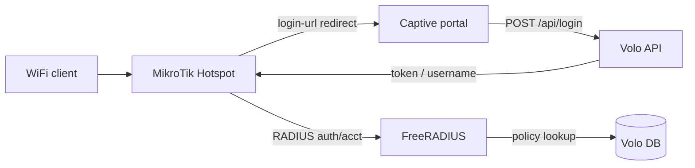

# Router Setup — MikroTik

**Document:** field setup guide for MikroTik routers used with Volo WiFi  
**Audience:** platform operators, org admins, network engineers  
**Related:** [Admin menu & onboarding](admin-menu.md)

---

## Overview

Volo WiFi uses **FreeRADIUS** for authentication and policy enforcement. MikroTik acts as the **NAS** via **Hotspot**: unauthenticated users are redirected to the external captive portal, and after portal login the router performs RADIUS authentication using the issued token or username.

Supported targets: **MikroTik RouterOS** devices with Hotspot (RB series, CCR, hAP, etc.).



---

## Prerequisites

Complete tenant onboarding before configuring RouterOS. See [Tenant onboarding lifecycle](admin-menu.md#tenant-onboarding-lifecycle).

| Step | Admin screen | Route | Required for router |
|-----:|--------------|-------|---------------------|
| 1 | Tenant Registration | `/wifi/billing/tenant-registration` | Active org + license |
| 2 | Access Control | `/wifi/tenant/access-control` | Operator accounts |
| 3 | Site Directory | `/wifi/sites` | WiFi site record |
| 3 | Service Plans | `/wifi/catalog/service-plans` | At least one plan |
| 3 | Vendor Profiles | `/wifi/network/radius/vendor-profiles` | MikroTik profile |
| 3 | Attribute Catalog | `/wifi/network/radius/attribute-catalog` | RADIUS reply attrs |
| 3 | Plan RADIUS Policies | `/wifi/network/radius/plan-policies` | Per-plan limits |
| 3 | NAS Devices | `/wifi/network/nas-devices` | Router inventory |
| 4+ | Partner / Access Tokens | `/wifi/commerce/...` | Live user tokens |

### Information to collect before setup

| Item | Example | Used in |
|------|---------|---------|
| Router management IP | `192.168.88.1` | Winbox / SSH |
| Hotspot NAS IP | `10.10.0.1` | `radiusClientIp`, FreeRADIUS client |
| RADIUS shared secret | strong random string | Site, NAS device, router, FreeRADIUS |
| FreeRADIUS server IP | `10.0.0.50` | `/radius` + NAS `nasServer` |
| Captive portal URL | `https://portal.example.com` | Site `portalBaseUrl` |
| Site code | `CAFE_WIFI` | Site Directory |
| NAS short name | `cafe-mikrotik-01` | NAS device `nasShortname` |

---

## Network requirements

| Traffic | Port | Direction |
|---------|------|-----------|
| RADIUS authentication | **1812/UDP** | MikroTik → FreeRADIUS |
| RADIUS accounting | **1813/UDP** | MikroTik → FreeRADIUS |
| CoA / Disconnect (optional) | **3799/UDP** | FreeRADIUS → MikroTik |
| Captive portal (HTTPS) | **443/TCP** | Client → portal host |
| Hotspot redirect (HTTP) | **80/TCP** | Client → MikroTik (redirect only) |

Allow UDP 1812/1813 from the MikroTik IP to the FreeRADIUS host. Add portal and API hosts to the Hotspot **walled garden**.

---

## Volo WiFi admin configuration

### 1. Create a MikroTik vendor profile

**Network → Vendor Profiles** (`/wifi/network/radius/vendor-profiles`)

| Field | Recommended value |
|-------|-------------------|
| Name | `MikroTik RouterOS Hotspot` |
| Vendor | `MikroTik` |
| Model | e.g. `RB4011`, `hAP ac²` |
| Supports CoA | **Yes** (if using disconnect / quota enforcement) |
| CoA port | `3799` |

### 2. Seed the attribute catalog

**Network → Attribute Catalog** (`/wifi/network/radius/attribute-catalog`)

Recommended attributes for MikroTik Hotspot:

| FreeRADIUS name | Display name | Op | Value type | Notes |
|-----------------|--------------|-----|------------|-------|
| `Session-Timeout` | Session Timeout | `:=` | INTEGER | Plan time quota (seconds) |
| `Acct-Interim-Interval` | Acct Interim Interval | `:=` | INTEGER | e.g. `300` |
| `Idle-Timeout` | Idle Timeout | `:=` | INTEGER | Optional |
| `Mikrotik-Rate-Limit` | Rate Limit | `:=` | STRING | e.g. `2M/2M` (optional bandwidth cap) |

Link these to the MikroTik vendor profile.

### 3. Define plan RADIUS policies

**Network → Plan RADIUS Policies** (`/wifi/network/radius/plan-policies`)

Example time-based plan:

| Attribute | Value | Notes |
|-----------|-------|-------|
| `Session-Timeout` | `{timeSeconds}` | From plan time quota |
| `Acct-Interim-Interval` | `300` | Fixed; enables interim updates |

For bandwidth-capped plans, add `Mikrotik-Rate-Limit` with a static string (e.g. `5M/5M`) or extend policies per deployment.

### 4. Register the WiFi site

**Tenant → Site Directory** (`/wifi/sites`) → **Network** tab

| Field | Value |
|-------|-------|
| Portal base URL | Public captive portal URL |
| RADIUS vendor profile | MikroTik profile |
| RADIUS client IP | Hotspot interface IP toward FreeRADIUS |
| RADIUS shared secret | Same secret used on RouterOS |

### 5. Register the NAS device

**Network → NAS Devices** (`/wifi/network/nas-devices`)

| Field | Value |
|-------|-------|
| Type | `Router` |
| Vendor | `MikroTik` |
| Model | Your RouterOS model |
| Linked site | WiFi site |
| IP address | Hotspot NAS IP |
| RADIUS client (NAS) | **Enabled** |
| NAS short name | e.g. `cafe-mikrotik-01` |
| RADIUS shared secret | Same as site |
| NAS type | `mikrotik` |

### 6. Register NAS on FreeRADIUS

```conf
client cafe-mikrotik-01 {
    ipaddr = 10.10.0.1
    secret = YOUR_SHARED_SECRET
    nas_type = other
    require_message_authenticator = no
}
```

Restart FreeRADIUS after updating clients.

---

## MikroTik RouterOS configuration

Examples use RouterOS v7 CLI (`/ip hotspot`). Adapt for Winbox menus if preferred.

Replace placeholders:

- `PORTAL_URL` → site `portalBaseUrl` (no trailing slash)
- `RADIUS_SERVER` → FreeRADIUS IP
- `HOTSPOT_SECRET` → shared secret from Volo WiFi

### 1. Hotspot interface and pool

```routeros
/ip pool add name=hs-pool ranges=10.10.10.2-10.10.10.254
/ip hotspot profile add name=volo-hotspot \
    hotspot-address=10.10.10.1 \
    dns-name=wifi.local \
    html-directory=hotspot \
    login-by=http-chap,http-pap,mac,cookie \
    http-cookie-lifetime=1d \
    use-radius=yes \
    radius-accounting=yes \
    radius-interim-update=5m \
    nas-port-type=wireless-802.11
/ip hotspot add name=volo interface=bridge-hotspot address-pool=hs-pool profile=volo-hotspot
```

Use your actual bridge/VLAN interface for guest traffic.

### 2. RADIUS client

```routeros
/radius add service=hotspot address=RADIUS_SERVER secret=HOTSPOT_SECRET authentication-port=1812 accounting-port=1813 timeout=3s
/ip hotspot profile set volo-hotspot use-radius=yes radius-accounting=yes
```

### 3. External login page (captive portal)

Point Hotspot to the Volo captive portal. The portal must read MikroTik query variables (`mac`, `ip`, `link-login`, `link-orig`, etc.) and POST them back as `nasParams`.

```routeros
/ip hotspot profile set volo-hotspot \
    login-url=PORTAL_URL/login \
    login-by=http-chap,http-pap,mac,cookie
```

Confirm the portal login route accepts MikroTik redirect parameters and, after `POST /api/login`, redirects the user to `link-login` with username = token and the password required by your Hotspot/RADIUS flow.

### 4. Walled garden

Allow portal and API traffic before authentication:

```routeros
/ip hotspot walled-garden ip add action=accept dst-host=portal.example.com
/ip hotspot walled-garden ip add action=accept dst-host=api.example.com
/ip hotspot walled-garden ip add action=accept protocol=udp dst-port=53
```

Add every host the portal needs (CDN, fonts, API subdomain).

### 5. Optional — rate limits and idle timeout

If plans do not push `Mikrotik-Rate-Limit` via RADIUS, set defaults on the profile:

```routeros
/ip hotspot user profile add name=default-rate rate-limit=2M/2M shared-users=1
/ip hotspot profile set volo-hotspot default-user-profile=default-rate
```

Prefer RADIUS-driven limits from **Plan RADIUS Policies** when possible.

### 6. Optional — incoming CoA

For disconnect / session update from FreeRADIUS:

```routeros
/radius incoming set accept=yes port=3799
```

Match **Vendor Profile → CoA port** (`3799`) in Volo WiFi.

### 7. Firewall

Ensure input chain allows established RADIUS replies and Hotspot traffic. Typical guest setup uses `fasttrack`/`accept` on the hotspot interface and blocks lateral movement to management VLANs.

---

## Captive portal integration

After MikroTik redirects the client, the portal should:

1. Parse Hotspot variables from the query string.
2. Call `POST /api/login` with the voucher token and `nasParams`.
3. On success, redirect to MikroTik `link-login` (or equivalent) so RouterOS sends RADIUS Access-Request with **User-Name** = token.

| Endpoint | Method | Purpose |
|----------|--------|---------|
| `/api/login` | POST | Authenticate token; optional `nasParams` |
| `/api/session` | POST | Store NAS state for post-login redirect |
| `/api/session` | GET | Retrieve saved NAS params |
| `/api/check/server` | GET | Health probe |

Login example:

```json
{
  "type": "VOUCHER_TOKEN",
  "token": "ABCD1234",
  "nasParams": {
    "mac": "AA:BB:CC:DD:EE:FF",
    "ip": "10.10.10.5",
    "link-login": "http://10.10.10.1/login?...",
    "link-orig": "http://example.com/"
  }
}
```

Volo maps `Credential.token` (uppercase) to FreeRADIUS **User-Name** for session tracking in `wf_radius_session`.

---

## End-to-end authentication flow

1. Client joins Hotspot → MikroTik intercepts HTTP → redirect to `login-url`.
2. User submits token on portal → `POST /api/login` validates credential and plan guards.
3. Portal redirects to `link-login` with credentials → MikroTik RADIUS Access-Request.
4. FreeRADIUS returns Access-Accept + `Session-Timeout` / other plan attributes.
5. MikroTik marks user active; accounting Start/Interim/Stop populate `RadiusSession`.

---

## Verification checklist

| # | Check | Where to confirm |
|---|-------|------------------|
| 1 | Site linked to MikroTik vendor profile | Site Directory |
| 2 | NAS device `nasType` = `mikrotik`, secret set | NAS Devices |
| 3 | `/radius print` shows correct server + secret | RouterOS |
| 4 | Walled garden allows portal + API | RouterOS |
| 5 | Portal opens from captive client | Phone / laptop |
| 6 | `GET /api/check/server` OK | curl / browser |
| 7 | Token login → internet access | End-to-end test |
| 8 | `/ip hotspot active print` shows user | RouterOS |
| 9 | RADIUS accounting in FreeRADIUS logs | `radius.log` |
| 10 | Session row created | Analytics / Live Sessions (P2) |

RADIUS test from FreeRADIUS server:

```bash
radtest ABCD1234 "" RADIUS_SERVER 0 HOTSPOT_SECRET
```

---

## Troubleshooting

| Symptom | Likely cause | Action |
|---------|--------------|--------|
| Redirect loop | `login-url` wrong or portal error | Fix URL; check `/api/check/server` |
| `radius timeout` | Firewall / wrong IP | Verify UDP 1812/1813; ping from MikroTik |
| Login OK, no internet | RADIUS reject | Check secret, token as User-Name, FreeRADIUS debug |
| `already authorizing` | Stale Hotspot cookie | Clear cookies; `/ip hotspot active remove` |
| No accounting records | `radius-accounting=no` | Enable on profile; check `/radius` service=hotspot |
| Session time not enforced | Missing `Session-Timeout` | Add Plan RADIUS Policy with `{timeSeconds}` |
| Rate limit ignored | Attribute not in reply | Add `Mikrotik-Rate-Limit` to plan policy |
| Device limit errors | Plan `maxDevices` guard | Expected; see captive login guards |

Enable RouterOS debug while testing:

```routeros
/system logging add topics=hotspot,debug action=memory
/radius monitor 0 once
```

---

## Reference — Volo WiFi data model

| Concept | Prisma model / field |
|---------|----------------------|
| Site | `WifiStation` — `portalBaseUrl`, `radiusClientIp`, `radiusSecret`, `radiusVendorProfileId` |
| Router inventory | `StationDevice` — `isRadiusClient`, `nasShortname`, `nasType` = `mikrotik` |
| Vendor capabilities | `RadiusVendorProfile` — `supportsCoA`, `coaPort` |
| Plan limits | `PlanRadiusAttribute` — reply attributes per plan |
| User credential | `Credential.token` → RADIUS `User-Name` |
| Portal NAS state | `CaptivePortalSession.nasParams` (14-day retention) |
| Live usage | `RadiusSession` — from RADIUS accounting |

---

## RouterOS quick reference (Winbox)

| Task | Location |
|------|----------|
| Hotspot profile | IP → Hotspot → Hotspot Profiles |
| RADIUS servers | Radius (left menu) → Add |
| Walled garden | IP → Hotspot → Walled Garden |
| Active users | IP → Hotspot → Active |
| Custom login URL | Hotspot Profile → Login tab → Login URL |

---

*Last updated for Volo WiFi MVP network module. Adjust CLI for your RouterOS major version and hardware interface names.*
