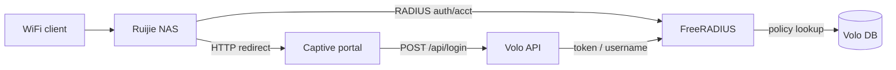

# Router Setup — Ruijie

**Document:** field setup guide for Ruijie gateways used with Volo WiFi  
**Audience:** platform operators, org admins, network engineers  
**Related:** [Admin menu & onboarding](admin-menu.md)

---

## Overview

Volo WiFi authenticates end users through **FreeRADIUS**. The Ruijie router acts as the **NAS** (Network Access Server): it redirects unauthenticated clients to the captive portal, sends RADIUS Access-Request messages after login, and reports session accounting.

Typical supported models include **RG-EG** series (e.g. RG-EG1510XS), **RG-NBR**, and other Ruijie enterprise gateways with **external portal + RADIUS AAA**.



---

## Prerequisites

Complete tenant onboarding before touching the router. See [Tenant onboarding lifecycle](admin-menu.md#tenant-onboarding-lifecycle).

| Step | Admin screen | Route | Required for router |
|-----:|--------------|-------|---------------------|
| 1 | Tenant Registration | `/wifi/billing/tenant-registration` | Active org + license |
| 2 | Access Control | `/wifi/tenant/access-control` | Operator accounts |
| 3 | Site Directory | `/wifi/sites` | WiFi site record |
| 3 | Service Plans | `/wifi/catalog/service-plans` | At least one plan |
| 3 | Vendor Profiles | `/wifi/network/radius/vendor-profiles` | Ruijie profile |
| 3 | Attribute Catalog | `/wifi/network/radius/attribute-catalog` | RADIUS reply attrs |
| 3 | Plan RADIUS Policies | `/wifi/network/radius/plan-policies` | Per-plan limits |
| 3 | NAS Devices | `/wifi/network/nas-devices` | Router inventory |
| 4+ | Partner / Access Tokens | `/wifi/commerce/...` | Live user tokens |

### Information to collect before setup

| Item | Example | Used in |
|------|---------|---------|
| Router management IP | `192.168.1.1` | Device access |
| NAS IP (toward RADIUS) | `10.10.0.1` | `radiusClientIp`, FreeRADIUS client |
| RADIUS shared secret | strong random string | Site, NAS device, router, FreeRADIUS |
| FreeRADIUS server IP | `10.0.0.50` | Router AAA + NAS `nasServer` |
| Captive portal URL | `https://portal.example.com` | Site `portalBaseUrl` |
| Site code | `BRANCH_01` | Site Directory |
| NAS short name | `branch-01-ruijie` | NAS device `nasShortname` |

---

## Network requirements

| Traffic | Port | Direction |
|---------|------|-----------|
| RADIUS authentication | **1812/UDP** | Ruijie → FreeRADIUS |
| RADIUS accounting | **1813/UDP** | Ruijie → FreeRADIUS |
| CoA / Disconnect (optional) | **3799/UDP** | FreeRADIUS → Ruijie |
| Captive portal (HTTPS) | **443/TCP** | Client → portal host |
| Volo API (HTTPS) | **443/TCP** | Portal → API backend |

Ensure the router can reach the FreeRADIUS host and that clients can reach the portal URL before enabling hotspot.

---

## Volo WiFi admin configuration

### 1. Create a Ruijie vendor profile

**Network → Vendor Profiles** (`/wifi/network/radius/vendor-profiles`)

| Field | Recommended value |
|-------|-------------------|
| Name | `Ruijie RG-EG1510XS` (or your model) |
| Vendor | `Ruijie` |
| Model | e.g. `RG-EG1510XS` |
| Supports CoA | **Yes** (default) |
| CoA port | `3799` |

Link supported attributes from **Attribute Catalog** (next step). Mark time/data attributes as **Required** when plans depend on them.

### 2. Seed the attribute catalog

**Network → Attribute Catalog** (`/wifi/network/radius/attribute-catalog`)

Recommended starter attributes for Ruijie + FreeRADIUS:

| FreeRADIUS name | Display name | Op | Value type | Notes |
|-----------------|--------------|-----|------------|-------|
| `Session-Timeout` | Session Timeout | `:=` | INTEGER | Plan time quota (seconds) |
| `Acct-Interim-Interval` | Acct Interim Interval | `:=` | INTEGER | e.g. `300` for usage sync |
| `Idle-Timeout` | Idle Timeout | `:=` | INTEGER | Optional idle disconnect |

Attach these to the Ruijie vendor profile.

### 3. Define plan RADIUS policies

**Network → Plan RADIUS Policies** (`/wifi/network/radius/plan-policies`)

Example for a 1-hour time plan:

| Field | Value |
|-------|-------|
| Plan | Your service plan |
| Vendor profile | Ruijie profile |
| Phase | `REPLY` |
| Attribute | `Session-Timeout` |
| Op | `:=` |
| Value | `{timeSeconds}` |
| Priority | `100` |

Add `Acct-Interim-Interval` with a fixed value (e.g. `300`) on every plan that needs live usage tracking.

Template placeholders supported by the admin UI: `{timeSeconds}`, `{dataMb}`, `{maxDevices}`.

### 4. Register the WiFi site

**Tenant → Site Directory** (`/wifi/sites`) → **Network** tab

| Field | Value |
|-------|-------|
| Portal base URL | Public captive portal URL |
| RADIUS vendor profile | Ruijie profile created above |
| NAS-Identifier | Optional; must match router if used |
| RADIUS client IP | Router IP as seen by FreeRADIUS |
| RADIUS shared secret | Same secret configured on router |

### 5. Register the NAS device

**Network → NAS Devices** (`/wifi/network/nas-devices`)

| Field | Value |
|-------|-------|
| Type | `Router` |
| Vendor | `Ruijie` |
| Model | e.g. `RG-EG1510XS` |
| Linked site | Your WiFi site |
| IP address | NAS IP |
| RADIUS client (NAS) | **Enabled** |
| NAS short name | e.g. `branch-01-ruijie` |
| RADIUS shared secret | Same as site / router |
| NAS type | `ruijie` |

### 6. Register NAS on FreeRADIUS

Add a matching client entry on the FreeRADIUS server (values must match Volo WiFi records):

```conf
client branch-01-ruijie {
    ipaddr = 10.10.0.1
    secret = YOUR_SHARED_SECRET
    nas_type = other
    require_message_authenticator = no
}
```

Use the NAS IP and secret from the site / NAS device screens. Restart FreeRADIUS after changes.

---

## Ruijie router configuration

Menu paths vary slightly by firmware (Reyee vs RGOS). Adjust labels to match your device UI.

### 1. Basic network

1. Configure LAN/WiFi SSID and DHCP as usual.
2. Ensure the router has a route to the FreeRADIUS server.
3. Set system time (NTP) — RADIUS and session expiry depend on accurate clocks.

### 2. RADIUS / AAA server

**Authentication → AAA / RADIUS** (or **Security → AAA**)

| Setting | Value |
|---------|-------|
| Primary RADIUS server | FreeRADIUS IP |
| Authentication port | `1812` |
| Accounting port | `1813` |
| Shared secret | Same as Volo WiFi site / NAS device |
| Accounting | **Enabled** |
| Interim accounting | **Enabled** (align with `Acct-Interim-Interval`) |

If the UI supports **CoA / DM (Disconnect Message)**, enable it on port **3799** to match the vendor profile.

### 3. Captive portal (external portal)

**Authentication → Web Auth / Portal** (or **User Management → Portal**)

| Setting | Value |
|---------|-------|
| Portal type | External / Third-party portal |
| Portal URL | Site `portalBaseUrl` (HTTPS) |
| Authentication method | RADIUS |
| User name source | RADIUS `User-Name` (token or username from portal) |

Pass-through parameters: the captive portal must receive NAS redirect parameters from the router (client MAC, NAS IP, redirect URL, etc.) and forward them to the Volo API as `nasParams` on login.

Volo captive API contract:

| Endpoint | Method | Purpose |
|----------|--------|---------|
| `/api/login` | POST | Submit token + optional `nasParams` |
| `/api/session` | POST | Persist NAS redirect state (authenticated) |
| `/api/check/server` | GET | Health check |

Login body (voucher token):

```json
{
  "type": "VOUCHER_TOKEN",
  "token": "ABCD1234",
  "nasParams": { }
}
```

The portal uses the token as the RADIUS **User-Name** for the next authentication cycle.

### 4. Bind portal to WiFi / interface

Apply web authentication to the target SSID or VLAN:

1. Select the wireless interface or VLAN serving guest traffic.
2. Enable **Portal authentication** / **Web auth**.
3. Choose the external portal profile and RADIUS server group configured above.

### 5. Walled garden / free resources

Allow unauthenticated access to:

- Captive portal host (`portalBaseUrl`)
- Volo API host (if different from portal)
- DNS (port 53) and any CDN assets the portal loads

Without these rules, the client cannot load the login page before authentication.

### 6. Optional — NAS-Identifier

If you set **NAS-Identifier** on the site record, configure the same value on the router (or ensure RADIUS packets present a consistent `NAS-Identifier` attribute). This helps session matching in **Live Sessions** and analytics.

---

## Data usage (bytes) — Ruijie EG / NBR as NAS

This applies when the **Ruijie router is the RADIUS NAS** (vendor profile Ruijie, `nasType = ruijie`), not when a Ruijie AP sits behind a MikroTik.

External / third-party portal does **not** stop data accounting. Volo writes `wf_radius_session.inputBytes` / `outputBytes` / `totalBytes` only from IETF:

- `Acct-Input-Octets` + `Acct-Input-Gigawords`
- `Acct-Output-Octets` + `Acct-Output-Gigawords`

on **Interim** and **Stop**. **Start** packets almost always have octets = 0; that is normal.

### Enable on the Ruijie gateway (RGOS / Reyee)

FreeRADIUS already maps IETF octets. If `wf_radius_session` has time but `inputBytes` / `outputBytes` / `totalBytes` stay 0, the EG is not putting those attributes in Interim/Stop packets. Change the gateway as follows.

**Authentication → AAA** (RGOS) or **Authentication → RADIUS** (Reyee), plus the portal/web-auth profile bound to that AAA:

| Setting | Required |
|---------|----------|
| RADIUS Accounting | **On**, UDP **1813** (auth 1812 is not enough) |
| Accounting scheme / mode | **Start-Interim-Stop** — not Start-Stop only, not Start-only |
| Carry **traffic / flow / octet** statistics | **On** (RGOS: “accounting includes flow”, “traffic accounting”, “flow statistics in accounting packets”) |
| Interim interval | **300** s **on the EG locally** and plan reply `Acct-Interim-Interval := 300` (EG often ignores the RADIUS reply) |
| Web auth / portal bound on the **LAN that NATs guest traffic** | If guests are bridged off the EG, or portal is on a VLAN the EG does not route, octets stay 0 |
| Do not use “local accounting only” | Online-user traffic on the EG UI is not written to Volo unless it is also sent in RADIUS |

After a real download, wait one interim (or disconnect for Stop). Inspect **INTERIM** / **STOP** rows — **START** rows never have bytes.

### If sessions exist but bytes stay 0 / null

| Cause | What it means |
|-------|----------------|
| Only **Start** rows | Wait for Interim/Stop; Start never has usage |
| Accounting on, **flow/traffic off** | EG sends `Acct-Session-Time` only — turn on traffic in accounting packets |
| EG ignores `Acct-Interim-Interval` | Set local interim on the router as well |
| Reyee / MACC firmware | Some cloud EG builds never put IETF octets in RADIUS; time still works |
| Bytes in **Ruijie VSAs** only (`Ruijie-Input-Octets`, vendor 4881) | Volo SQL maps **IETF names only**, so those packets look like “no data”. On the EG enable IETF / standard RADIUS traffic attributes (not Ruijie-only VSAs) |

Confirm with FreeRADIUS accounting debug (`radiusd -X` or `radsniff -x -p 1813`). On Interim/Stop you must see `Acct-Input-Octets` / `Acct-Output-Octets` with non-zero values. If those attributes are missing, the NAS is not sending IETF traffic — Volo cannot invent it. If you see `Vendor-Specific` from Ruijie instead, the gateway is sending VSAs and the SQL mapping needs those names.

---

## End-to-end authentication flow

1. Client associates with guest WiFi → Ruijie redirects HTTP to `portalBaseUrl` with NAS parameters.
2. User enters voucher token on captive portal → portal calls `POST /api/login`.
3. Volo validates credential, applies plan guards, returns success cookies.
4. Portal triggers router login (vendor-specific) using the token as RADIUS username.
5. Ruijie sends RADIUS Access-Request → FreeRADIUS → Access-Accept with plan reply attributes (`Session-Timeout`, etc.).
6. Ruijie opens access; accounting Start/Interim/Stop records flow to FreeRADIUS → `wf_radius_session`.

---

## Verification checklist

| # | Check | Where to confirm |
|---|-------|------------------|
| 1 | Site status `ACTIVE`, vendor profile linked | Site Directory |
| 2 | NAS device has secret + `isRadiusClient` | NAS Devices |
| 3 | FreeRADIUS client IP/secret matches | `radtest` / FreeRADIUS debug |
| 4 | Portal loads on captive WiFi | Client browser |
| 5 | `GET /api/check/server` returns OK | Portal / curl |
| 6 | Test token login succeeds | Access Tokens + portal |
| 7 | RADIUS Accept in auth log | Network → Auth Events (P2) / `radpostauth` |
| 8 | Session appears with usage | Network → Live Sessions (P2) / Analytics |

Quick RADIUS test from the FreeRADIUS host:

```bash
radtest ABCD1234 "" RADIUS_SERVER_IP 0 YOUR_SHARED_SECRET
```

Replace `ABCD1234` with a valid issued token.

---

## Troubleshooting

| Symptom | Likely cause | Action |
|---------|--------------|--------|
| Portal does not open | Walled garden / DNS | Add portal + API hosts to free rules |
| Login OK but no internet | RADIUS reject or missing Accept | Check FreeRADIUS logs; verify token is RADIUS User-Name |
| `Access-Reject` immediately | Secret mismatch or unknown NAS | Align NAS IP + secret across router, Volo, FreeRADIUS |
| Session never ends at plan limit | Missing `Session-Timeout` policy | Add Plan RADIUS Policy with `{timeSeconds}` |
| Usage not updating | Accounting disabled | Enable accounting + interim on router; set `Acct-Interim-Interval` |
| Sessions exist but **bytes stay 0** | See **Data usage (bytes) on Ruijie** below | Enable traffic in accounting packets; confirm the NAS is the EG, not a bridge AP |
| CoA disconnect fails | UDP 3799 blocked | Open firewall; confirm vendor profile CoA port |
| Duplicate session blocked | Plan `maxDevices` / single-session guard | Expected behavior; revoke stale session or adjust plan |

---

## Reference — Volo WiFi data model

| Concept | Prisma model / field |
|---------|----------------------|
| Site | `WifiStation` — `portalBaseUrl`, `radiusClientIp`, `radiusSecret`, `radiusVendorProfileId` |
| Router inventory | `StationDevice` — `isRadiusClient`, `nasShortname`, `nasType` = `ruijie` |
| Vendor capabilities | `RadiusVendorProfile` — `supportsCoA`, `coaPort` |
| Plan limits | `PlanRadiusAttribute` — reply attributes per plan |
| User credential | `Credential.token` → RADIUS `User-Name` |
| Live usage | `RadiusSession` — fed by RADIUS accounting |

---

*Last updated for Volo WiFi MVP network module. Firmware-specific Ruijie screenshots may be added per deployment.*
